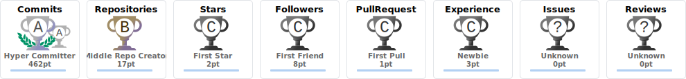

<h1 align="center">
   
  Olá, eu sou o Tiago Antunes!
</h1>

<h3 align="center">Desenvolvedor Web em Formação | Estudante no Senac</h3>

### 👨‍💻 Sobre mim

- 🔭 Trabalhando no desenvolvimento de um **projeto de e-commerce (Loja online de doces)**.
- 🌱 Focando meus estudos atuais no ecossistema **Angular, TypeScript e Java**.
- 🎓 Cursando **Sistemas para a Internet no Senac**.
- 💡 Apaixonado por desenvolvimento Web, arquitetura de computadores e redes.
- ⚽ Fora do código, sempre acompanhando um bom futebol.

---

### 💻 Minhas Linguagens e Ferramentas

<table>
  <tr>
    <!-- COLUNA ESQUERDA (BADGES) -->
    <td>

#### 🔧 Linguagens

#### 🚀 Frameworks

#### 🗄️ Bancos de Dados

  

#### 🛠️ Ferramentas & Editores

  
  
  
  
  

  </td>
    <td align="center">
      
    </td>
  </tr>
</table>

---

### 🏆 Meus Troféus do GitHub

  

---

### 📊 Minhas Estatísticas

  

 

  

---

### 🐍 Contribuições (Snake)

  

---

### 😜 Para descontrair:

  

---

### 📫 Como me encontrar

  
  
  

<!--END_SECTION:waka-->

  
### Mostre seu ❤️ deixando uma 🌟 nos meus [repositórios](https://github.com/TiagoAntunes-Dev?tab=repositories)!

