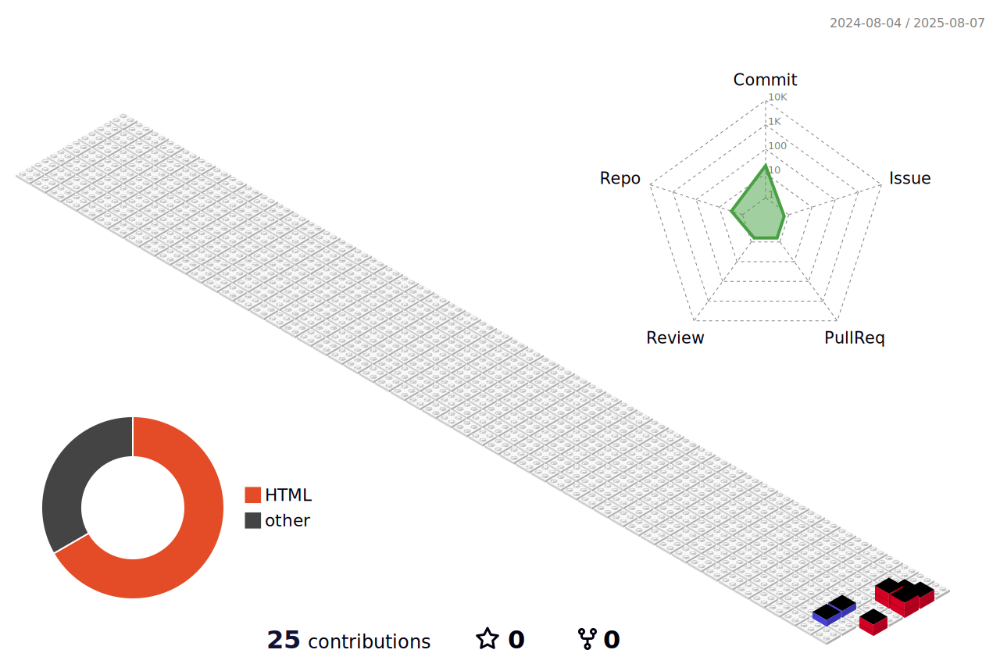

<h1 align="center">Tiago Antunes</h1>

  Desenvolvedor Full Stack em formação · Estudante de TI 

---

---

## Sobre

- Estudante de Sistemas para Internet SENAC
- Em formação como desenvolvedor **full stack**, com foco em **JavaScript, Node.js e CSS**
- Em busca do **primeiro estágio** na área de tecnologia
- Interessado em **UI/UX, acessibilidade**, boas práticas e código limpo

## Projetos em destaque

> *(em construção – atualizarei conforme for desenvolvendo)*
- Repositórios de estudo com HTML, CSS, Git e JavaScript
- [Suporte de Domingo](https://suportededomingo.com.br/) – Soluções digitais e agendamento personalizado
- [Code Trouble](https://codetrouble.com.br) – Comunidade aberta para desenvolvedores e troca de conhecimento

## Contato

- [LinkedIn](https://www.linkedin.com/in/lucascorreaa/)
- E-mail: tiagozaped@gmail.com
- [Portfólio] *(Portfólio em construção)*
- [Instagram - Professor Corrêa](https://www.instagram.com/professorcorrea)

---

> “O sucesso é a soma de pequenos esforços repetidos dia após dia.” – Robert Collier
